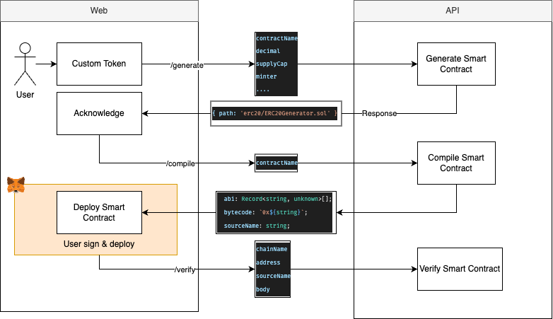

<p align="center">
  <a href="https://jfinchain.com/" target="blank"></a>
</p>
<p align="center">JFIN CHAIN BEYOND THE FUTURE.</p>

<p align="center">
    <a href="https://www.facebook.com/JFINofficial" target="_blank">
        
    </a>
    <a href="https://twitter.com/jfinofficial" target="_blank">
        
    </a>
</p>
<hr/>

<p align="center">
    Official <a href="https://github.com/jventures-jdn/project-staking-ui">Token Generator</a> Monorepo
</p>

# 🔧 Installation

This project uses [pnpm](https://pnpm.io/) as the package manager.

```bash
pnpm install
```

<br/>

# Workflow



# 📁 Project Structure

This monorepo is organized using a standard `apps/` structure:

- **`apps/token-generator-web`**: The frontend web application.
- **`apps/token-generator-api`**: The backend API service.

⚠️ Both apps must be running for the project to function properly.

### Explanation

- **`apps/`**: Contains the main applications in the monorepo.

  - **`token-generator-web/`**: The frontend web application.
    - **`src/`**: Contains the source code for the web app.
      - **`components/`**: Reusable UI components.
      - **`pages/`**: Page-level components for routing.
      - **`utils/`**: Utility functions for the web app.
      - **`hooks/`**: Custom React hooks.
    - **`public/`**: Static assets like `index.html` and `favicon.ico`.
    - **`tests/`**: Contains integration and unit tests for the web app.
  - **`token-generator-api/`**: The backend API service.
    - **`src/`**: Contains the source code for the API.
      - **`controllers/`**: Handles incoming requests and responses.
      - **`routes/`**: Defines API endpoints.
      - **`services/`**: Business logic and data handling.
    - **`tests/`**: Contains integration and unit tests for the API.
    - **`Dockerfile`**: Configuration for containerizing the API.

- **`packages/`**: Contains shared libraries or utilities used across the monorepo.

  - **`shared/`**: Shared code such as utility functions and TypeScript types.

- **`.github/`**: Contains GitHub Actions workflows for CI/CD.

<br/>

### Package Manager

- **pnpm**: A fast, disk space-efficient package manager.

### Build and Task Runner

- **Turbo**: For running tasks in a monorepo setup.
- **npm-run-all**: For running multiple npm scripts in parallel or sequentially.

### Testing

- **Jest** (not explicitly listed but likely used based on common practices): For unit and integration testing.

### Deployment and Containerization

- **Docker**: Used for running services like Redis (via `docker-compose`).

### Additional Tools

- **Redis**: A key-value store, likely used for caching or session management (based on the `redis` script).

<br/>

# 🚀 Usage

### Run (Development)

To start both the web and API in development mode:

```bash
pnpm dev
```

Alternatively, you can run each app individually:

```bash
# Web only
pnpm --filter ./apps/token-generator-web dev

# API only
pnpm --filter ./apps/token-generator-api dev
```

### Build

To build both the frontend and backend:

```bash
pnpm build
```

### Start (Production)

To start the built version of the project:

```bash
pnpm start
```

### Clean

To remove all node_modules in the entire project:

```bash
pnpm clean
```

### Lint

To lint the codebase and auto-fix basic issues:

```bash
pnpm lint
```

### Test

To run all tests across both web and API apps:

```bash
pnpm test
```

<br/>

### 📦 Syncpack

We use [Syncpack](https://github.com/JamieMason/syncpack) to maintain consistent dependency versions across the monorepo.
| Command | Description |
| ------------------------------------- | --------------------------------------------------------- |
| `pnpm syncpack:format` | Format `package.json` files for consistency |
| `pnpm syncpack:sync` | Run all sync tasks in parallel |
| `pnpm syncpack:sync:mismatches` | Fix mismatched dependency versions |
| `pnpm syncpack:sync:semver` | Lint semantic version ranges |
| `pnpm syncpack:update` | Update all dependencies to the latest matching version |

### 📝 Changeset

This project uses [Changesets](https://github.com/changesets/changesets) for versioning and changelog generation in the monorepo.
| Command | Description |
| ----------------------------- | ------------------------------------------------------- |
| `pnpm changeset:gen` | Generate a new changeset using the conventional format |
| `pnpm changeset:status` | View the current unpublished changesets |
| `pnpm changeset:version` | Apply changeset versions to packages |
| `pnpm changeset:publish` | Publish packages and update changelogs |
<br/>

# ✈️ Deployment

The `token-generator` project uses GitHub Actions for automated deployment of both the frontend (`token-generator-web`) and backend (`token-generator-api`). Below is an overview of the deployment process:

## Frontend Deployment (`token-generator-web`)

The frontend is deployed to **Cloudflare Pages**. The deployment process is triggered when:

- A tag matching the pattern `*/token-generator-web@[0-9].[0-9].[0-9]` is pushed to the repository.
- The workflow can also be triggered manually using `workflow_dispatch`.

### Steps:

1. **Setup pnpm**: Installs the specified version of `pnpm`.
2. **Checkout Code**: Clones the repository.
3. **Install Dependencies**: Installs all required dependencies using `pnpm install`.
4. **Build the Web Application**:
   - Runs `pnpm turbo build` to build the monorepo.
   - Runs `pnpm build:page` to build the frontend application.
5. **Publish to Cloudflare Pages**:
   - Deploys the built static files to **Cloudflare Pages** using the `cloudflare/pages-action`.

### Environment Variables:

- `NEXT_PUBLIC_TOKEN_GENERATOR_API_ENDPOINT`: The API endpoint used by the frontend.

## Backend Deployment (`token-generator-api`)

The backend is deployed to **Google Cloud Run**. The deployment process is triggered when:

- A tag matching the pattern `*/token-generator-api@[0-9].[0-9].[0-9]` is pushed to the repository.
- The workflow can also be triggered manually using `workflow_dispatch`.

### Steps:

1. **Checkout Code**: Clones the repository.
2. **Login to GitHub Container Registry**: Authenticates with GitHub's container registry.
3. **Login to Google Cloud**: Authenticates with Google Cloud using a service account.
4. **Extract Metadata**: Generates Docker image tags and labels.
5. **Build and Push Docker Image**:
   - Builds the Docker image using `Dockerfile.API`.
   - Pushes the image to **Google Container Registry (GCR)**.
6. **Deploy to Google Cloud Run**:
   - Deploys the Docker image to **Google Cloud Run**.
   - Configures environment variables for the API.

### Environment Variables:

- `NEXT_PUBLIC_TOKEN_GENERATOR_WEB_ENDPOINT`: The frontend endpoint used by the backend.

<br/>

# 🎯 Roadmap

### Project Structure

- [x] setup prettier, linter, tsconfig, tailwind configuration
- [x] setup workspace husky, commitlint, syncpack script configuration
- [x] setup frontend, backend, libs repo

### CI/CD

- [x] setup cloudflare configuration for web deployment
- [x] setup glcoud configuration for api for deployment
- [x] setup secrets for github actions
- [x] setup dockerfile for frontend
- [x] setup dockerfile for backend
- [x] make hardhat runable in backend container
- [x] make changeset release version when merge to main
- [ ] make changeset publish to npm when merge to main
- [x] github actions for build, test, deploy
- [x] github actions for release package
- [ ] github actions for publish package

### Backend

- [x] endpoint for read original, generated smart contract
- [x] endpoint for generate smart contract with new name
- [x] endpoint for compile generated smart contract
- [x] endpoint for verify generated smart contract
- [x] endpoint for remove generated & compile smart contract
- [x] endpoint for read abi, bytecode from compiled smart contract
- [x] setup test for contract endpoints
- [x] setup in-memory redis for testing & development

## Team

- [JVenture Team](https://github.com/orgs/jventures-jdn)

## Contact Us

For business inquiries: info@jventures.co.th
